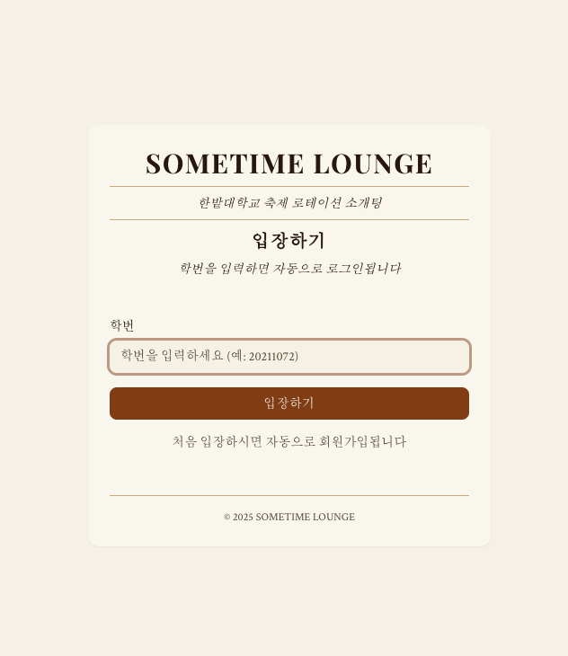
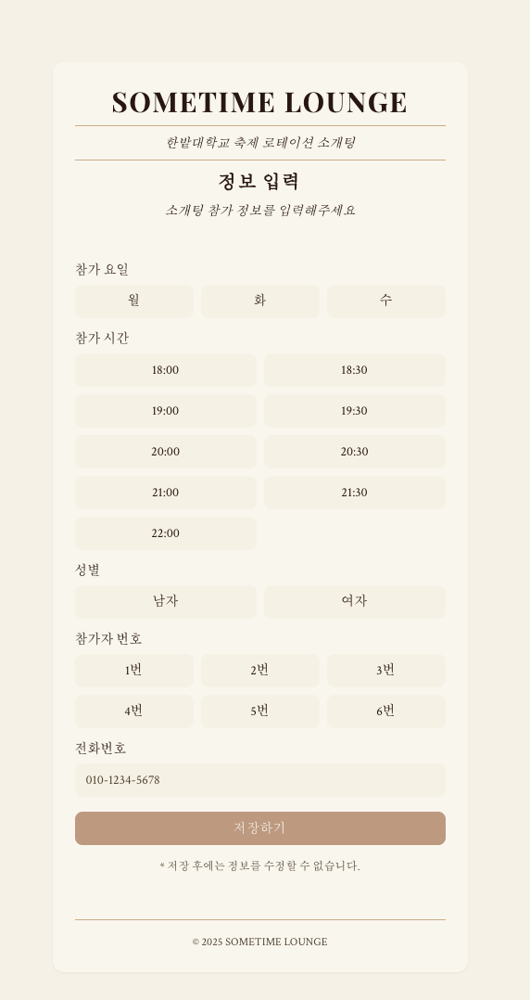

# 🌙 SOMETIME LOUNGE

> **한밭대학교 동아리페스티벌 로테이션 소개팅을 위한 매칭 서비스**

## 📖 프로젝트 배경

### 문제 상황

한밭대학교 동아리페스티벌에서 진행된 로테이션 소개팅 서비스에서 다음과 같은 문제점들이 발견되었습니다:

- **시간 부족**: 30분 동안 6명의 남녀가 5분씩 로테이션하며 대화하는 시스템에서 연락처 교환 시간이 매우 부족
- **심리적 부담**: 직접 연락처를 물어보기에는 부끄럽고 부담스러운 상황
- **매칭 어려움**: 서로 마음에 들어도 연락처를 교환할 기회를 놓치는 경우가 빈번

### 해결 방안

이러한 문제를 해결하기 위해 **SOMETIME LOUNGE**를 개발했습니다:

- 🗳️ **익명 투표 시스템**: 마음에 드는 사람의 번호에 투표
- 💕 **상호 매칭**: 양방향으로 투표가 이루어진 경우에만 연락처 교환
- 📱 **자동 연락처 공유**: 매칭 성공 시 전화번호나 인스타그램 ID 자동 교환
- 🔒 **프라이버시 보호**: 매칭되지 않은 경우 개인정보 노출 없음

---

## 🚀 사용법

### 1. 서비스 접속

- QR 코드를 스캔하거나 제공된 링크로 접속
- 학번만 입력하면 자동으로 회원가입/로그인

### 2. 프로필 등록

- 참여할 요일과 시간대 선택 (월/화/수, 18:00-22:00)
- 성별과 참가자 번호 입력 (1-6번)
- 연락처 정보 입력 (전화번호 필수)

### 3. 투표하기

- 관리자가 투표를 오픈하면 같은 시간대 반대 성별 참가자 목록 확인
- 마음에 드는 사람들의 번호에 체크박스로 투표
- 여러 명 선택 가능, 언제든 수정 가능

### 4. 결과 확인

- 관리자가 결과를 공개하면 매칭된 상대방 정보 확인
- 상호 투표가 이루어진 경우에만 연락처 정보 공개
- 매칭 실패 시에는 개인정보 노출 없음

---

## 📱 서비스 스크린샷

### 홈 화면


_서비스 메인 화면 - 학번을 입력하여 간편하게 로그인할 수 있습니다_

### 프로필 등록 화면


_로그인 후 프로필 등록 페이지 - 참여할 시간대, 성별, 참가자 번호, 연락처를 입력합니다_

### 관리자 페이지

_관리자 전용 페이지에서는 시간대별 투표 및 결과 공개를 제어하고 실시간 통계를 확인할 수 있습니다_

- 로테이션 소개팅 결과 제어
- 시간대별 투표 오픈/클로즈 관리
- 실시간 참가자 및 매칭 통계 확인

---

## 🏗️ **기술 스택**

- **프론트엔드**: Next.js 15.5.4 (App Router)
- **백엔드**: Supabase (PostgreSQL + REST API)
- **인증**: 커스텀 인증 시스템 (학번 기반)
- **상태관리**: localStorage + React useState
- **스타일링**: Tailwind CSS + shadcn/ui

---

## 🔧 개발자를 위한 기술 문서

### 🔐 **인증 시스템**

**자동 회원가입/로그인 플로우:**

```
학번 입력 → 기존 사용자 확인 → 없으면 자동 회원가입 + 로그인 → 프로필 페이지로 이동
                          → 있으면 자동 로그인 → 메인 페이지로 리다이렉트
```

**특징:**

- 비밀번호 불필요 - 학번만으로 인증
- 처음 입장 시 자동 회원가입
- localStorage에 세션 저장

### 💕 **매칭 알고리즘**

**3단계 매칭 프로세스:**

```
1단계: 내가 투표한 프로필들 조회
2단계: 그 중에서 나에게도 투표한 프로필들 찾기 (상호 투표)
3단계: 상호 투표된 프로필들의 상세 정보 반환
```

### 📊 **데이터베이스 구조**

**핵심 테이블:**

- `users`: 커스텀 인증 (학번, 비밀번호)
- `profiles`: 사용자 프로필 정보
- `votes`: 투표 데이터
- `time_slot_settings`: 시간대별 투표/결과 상태 관리

**관계:**

```
users (1) ←→ (1) profiles
profiles (1) ←→ (N) votes (voter)
profiles (1) ←→ (N) votes (voted_for)
```

### 🎯 **핵심 비즈니스 규칙**

1. **학번 기반 인증**: 이메일 없이 학번만으로 가입/로그인
2. **시간대별 격리**: 같은 요일/시간대 내에서만 매칭
3. **상호 투표 매칭**: 양방향 투표가 있어야만 매칭 성공
4. **관리자 중심 제어**: 모든 투표/결과 공개는 관리자가 시간대별로 제어
5. **프라이버시 보호**: 매칭되지 않은 경우 개인정보 노출 없음

---

## 🚀 로컬 개발 환경 설정

### 1. 프로젝트 클론

```bash
git clone https://github.com/YUJAEYUN/sometimeLounge.git
cd sometimeLounge
```

### 2. 의존성 설치

```bash
npm install
```

### 3. 환경 변수 설정

`.env.local` 파일을 생성하고 Supabase 정보를 입력:

```env
NEXT_PUBLIC_SUPABASE_URL=your_supabase_url
NEXT_PUBLIC_SUPABASE_ANON_KEY=your_supabase_anon_key
```

### 4. 개발 서버 실행

```bash
npm run dev
```

---

## 📱 배포

- **프로덕션 URL**: https://sometime-lounge.vercel.app
- **배포 플랫폼**: Vercel
- **데이터베이스**: Supabase

---

## 📞 문의

프로젝트에 대한 문의사항이나 개선 제안이 있으시면 언제든 연락주세요!

---

## 📄 라이선스

이 프로젝트는 한밭대학교 동아리페스티벌을 위해 개발되었습니다.
